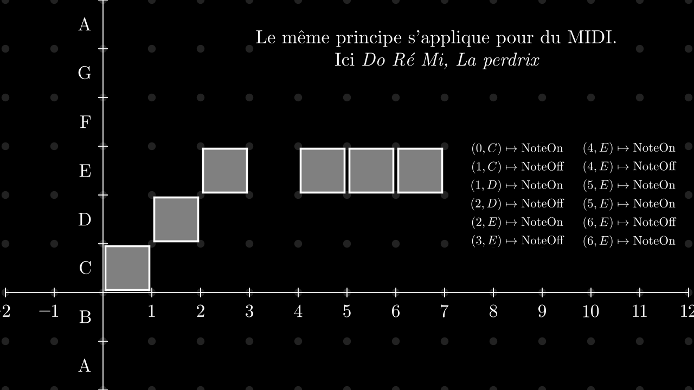
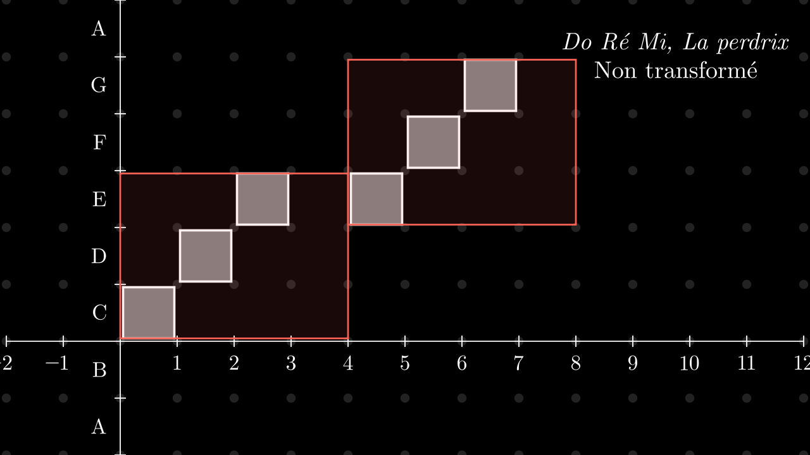
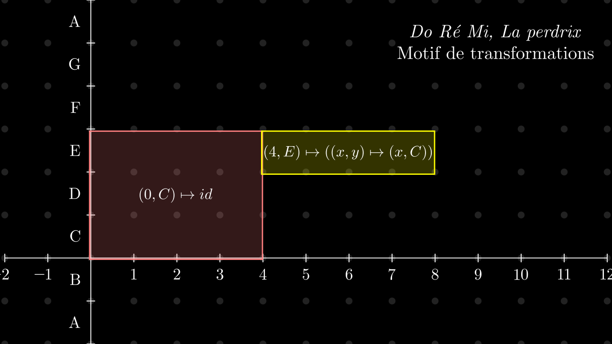
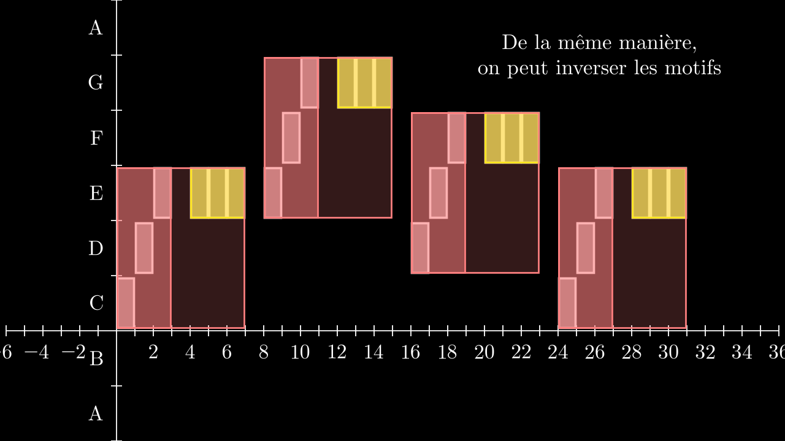
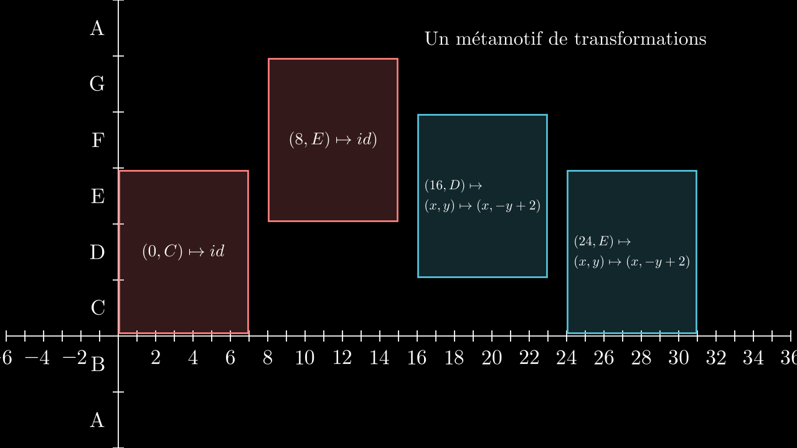
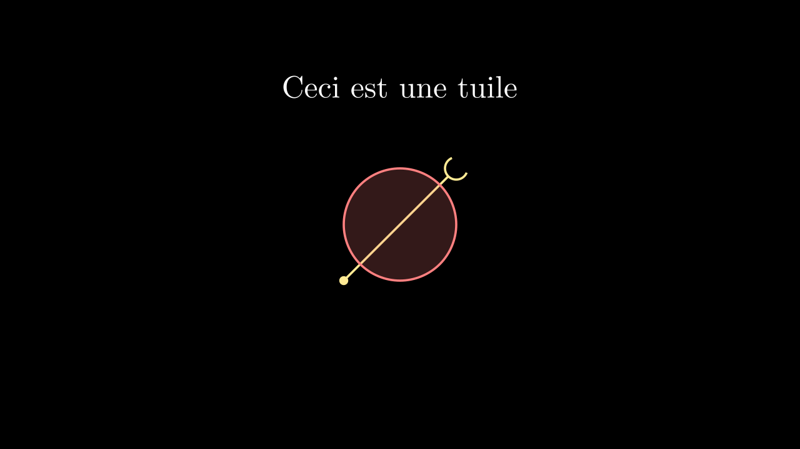
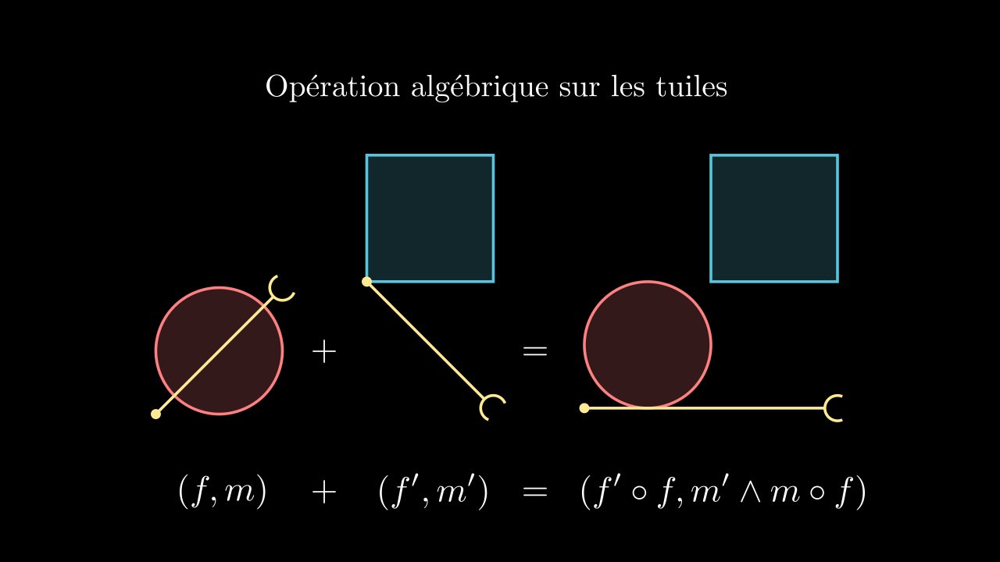
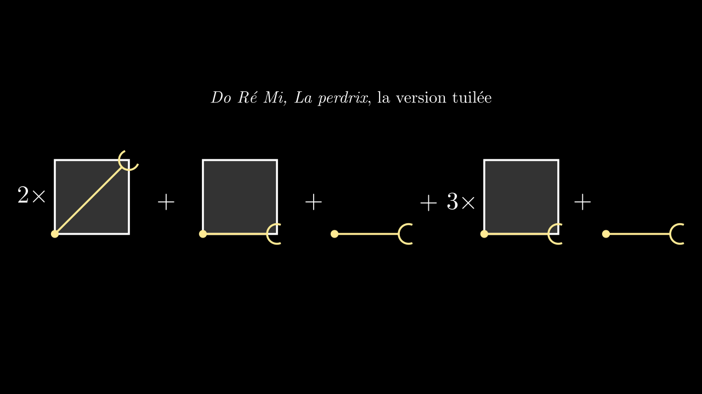
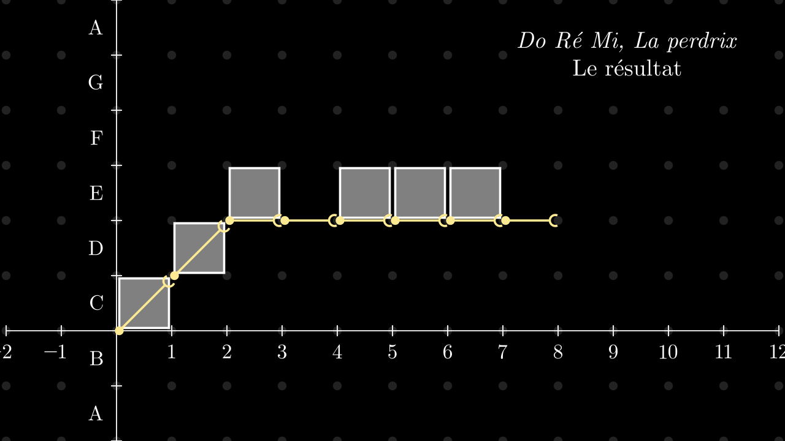

<!-- _class: title -->

# Représenter les médias de manière structurée

## **Une introduction aux tuiles hiérarchisées**

### Alice Rixte

#### Université de Bordeaux

##### 14 Septembre 2023
##### Journée Musiscale, CRIStAL, Lille

---

# Qu'est-ce que la structure (en musique) ?

William E. Thomson, Functional Ambiguity in Musical Structures, 1983

Musical structure [...] refers to the way
elements are organized into patterns of coherence, the perceptual act of small events joining to create large events.

Morris R. Cohen, A preface to logic, 1944

Anything acquires meaning if it is connected with, or indicates, or refers to, something beyond itself, so that its full nature points to and is revealed in that connection.

---

# La structure pourrait donc être 

## 1. Une hiérarchie

Des atomes sont combinés pour former des structures, elles-mêmes combinées en des métastructures de plus en plus complexes.

## 2. Une articulation de cette hiérarchie

Les différents composants de cette hiérarchie sont mis rapport les uns avec les autres.

---

# Plan

## 1. Hiérarchie de motifs

- Niveau 0 (atomes) : note de musique, lettre, pixel ...
- Niveau 1 (motif d'atomes) : mesure, mot ...
- Niveau 2 (motif de motif d'atomes) : phrase ...
- Niveau 3 (motif de motif de motif d'atomes) : section, paragraphe ...
- ...

---
# Plan

## 2. Transformation des motifs
Elles permettent d'exprimer les similarités entre motifs.

- Déplacements
- Symmétries
- Dilatations
- Déformations
- ...

---
# Plan

## 3. Construction de motifs

- Processus de composition
- Opérations algébrique sur les motifs
- Langage de programmation

---

# 1. La hiérarchie des motifs

---

<!-- _class: manim-->

<video autoplay src="./media/videos/presentation-structure-tuile/720p30/FourPixels.mp4" >

---

<!-- 
_backgroundColor: black
_class: dark
-->

# Plus formellement
- Un motif est une fonction partielle d'un espace $X$ dans un ensemble de couleurs ou d'évènements $C$
- Le type des motifs est $M = X \rightharpoonup C$

---

<!-- _class: manim-->

---

<!-- _class: manim-->

<video autoplay onclick="this.play()" src="./media/videos/presentation-structure-tuile/720p30/DoReMiNiveau0.mp4" >

---

<!-- _class: manim-->

<video autoplay onclick="this.play()"  src="./media/videos/presentation-structure-tuile/720p30/DoReMiNiveau05.mp4" >

---

<!-- 
_backgroundColor: black
_class: dark
-->

# Métamotifs

Et si ?

Et si on remplaçait les couleurs par des motifs ?

- Le type des métamotifs est alors
 $M_2 = X \rightharpoonup M= X \rightharpoonup (X \rightharpoonup C)$

---

<!-- _class: manim-->

<video autoplay onclick="this.play()"  src="./media/videos/presentation-structure-tuile/720p30/DoReMiNiveau1.mp4" >

---

<!-- _class: manim-->

<video autoplay onclick="this.play()"  src="./media/videos/presentation-structure-tuile/720p30/DoReMiNiveau2.mp4" >

---

<!-- _class: manim-->

<video autoplay onclick="this.play()"  src="./media/videos/presentation-structure-tuile/720p30/DoReMiNiveau3.mp4" >

---

<!-- 
_backgroundColor: black
_class: dark
-->

# Récapitulons

- Les motifs $m: X\rightharpoonup C$ sont des fonctions partielles d'un espace $X$ vers les couleurs $C$
- Les méta-motifs $m: X\rightharpoonup M$ sont des fonctions partielles d'un espace $X$ vers les sous-motifs $M$
- En réitérant cette construction, on obtient une _hiérarchie de motifs_.

---

<!-- 
_backgroundColor: black
_class: dark
-->

# 2.  **Transformations de motifs**

---

<!-- _class: manim-->

<video autoplay onclick="this.play()"  src="./media/videos/presentation-structure-tuile/720p30/Translation.mp4" >

---

<!-- _class: manim-->

<video autoplay onclick="this.play()"  src="./media/videos/presentation-structure-tuile/720p30/Symmetry.mp4" >

---

<!-- _class: manim-->

<video autoplay onclick="this.play()"  src="./media/videos/presentation-structure-tuile/720p30/Contraction.mp4" >

---

<!-- 
_backgroundColor: black
_class: dark
-->

#  Motifs de transformations

- On aimerait exprimer le fait que "La Perdrix" correspond à une version constante de "Do Ré Mi".
- Utilisons des motifs de transformations ! 
- Un motif de transformation associe aux points de l'espace une transformation : $m: X \rightharpoonup (X\rightarrow X)$

---

<!-- _class: manim-->

---

<!-- _class: manim-->

---

<!-- _class: manim-->

<video autoplay onclick="this.play()"  src="./media/videos/presentation-structure-tuile/720p30/DoReMiProjection.mp4" >

---

<!-- _class: manim-->

---

<!-- _class: manim-->

---

<!-- _class: manim-->

<video autoplay onclick="this.play()"  src="./media/videos/presentation-structure-tuile/720p30/Inversion3.mp4">

---

<!-- 
_backgroundColor: black
_class: dark
-->

# Récapitulons

- On peut transformer des motifs en appliquant des transformations de l'espace.
- Les motifs de transformations permettent d'appliquer les transformations localement.

---

<!-- 
_backgroundColor: black
_class: dark
-->

# 3. Construction de motifs

---

<!-- _class: manim -->

<video autoplay onclick="this.play()"  src="./media/videos/presentation-structure-tuile/720p30/ShowSpace.mp4">

---

<!-- _class: manim -->

<video autoplay onclick="this.play()"  src="./media/videos/presentation-structure-tuile/720p30/FirstCircle.mp4">

---

<!-- _class: manim -->

<video autoplay onclick="this.play()"  src="./media/videos/presentation-structure-tuile/720p30/FirstTransform.mp4">

---

<!-- _class: manim -->

<video autoplay onclick="this.play()"  src="./media/videos/presentation-structure-tuile/720p30/WholeDrawing.mp4">

---

<!-- 
_backgroundColor: black
_class: dark
-->

# Les tuiles

- Combiner motifs et transformations permet d'obtenir un processus itératif pour dessiner.
- Les motifs sont du contenu hiérarchisé.
- Les transformations explicitent l'articulation de ce contenu.

Les tuiles, enfin !

Une tuile $t = (f,m)$ est une paire d'une transformation $f : X \rightharpoonup X$ et d'un motif $m : X\rightharpoonup M$.

---

<!-- _class: manim-->

---

<!-- _class: manim-->

---

<!-- _class: manim-->

---

<!-- _class: manim-->

---

<!-- _class: manim -->

<video autoplay onclick="this.play()"  src="./media/videos/presentation-structure-tuile/720p30/DoReMiTuile1.mp4">

---

<!-- 
_backgroundColor: black
_class: dark
-->

# Ce que les tuiles permettent

- Placer des motifs les uns par rapports aux autres.
- Dupliquer des motifs dans l'espace et dans le temps.
- Les chevauchements de motifs
- ...

---

<!-- 
_backgroundColor: black
_class: dark
-->

# Conclusion

Les tuiles hiérarchisées sont un langage mathématique permettant : 

1. la structuration hiérarchique d'un media 
1. la mise en évidence des similarités des sous-motifs via les transformations 
1. une approche constructiviste (ou compositionnelle) reposant sur l'opérateur $+$ des tuiles.

---
<!-- 
_backgroundColor: black
_class: dark
-->
#  Travaux en cours et futurs

- Implémentation
- Moteur de rendus vers différents média
- Contrôle temps-réel sur la structure
- Performances multimédia

---

<!-- _class: manim -->

<video autoplay loop onclick="this.play()"  src="./media/videos/presentation-structure-tuile/720p30/SpirographCranks.mp4">

---
<!-- 
_backgroundColor: black
_class: dark
-->
#  Des questions ?