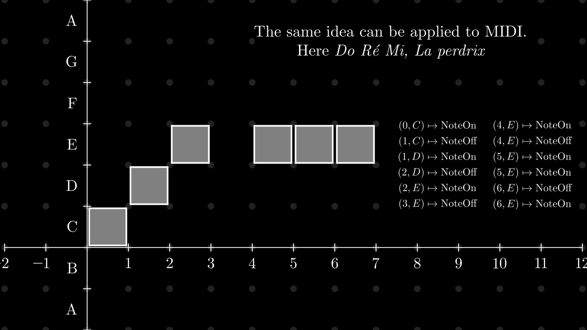
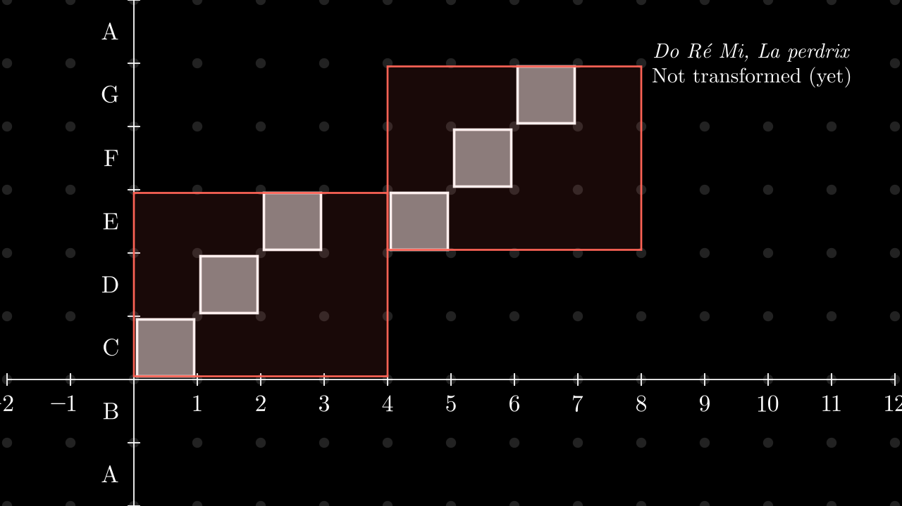
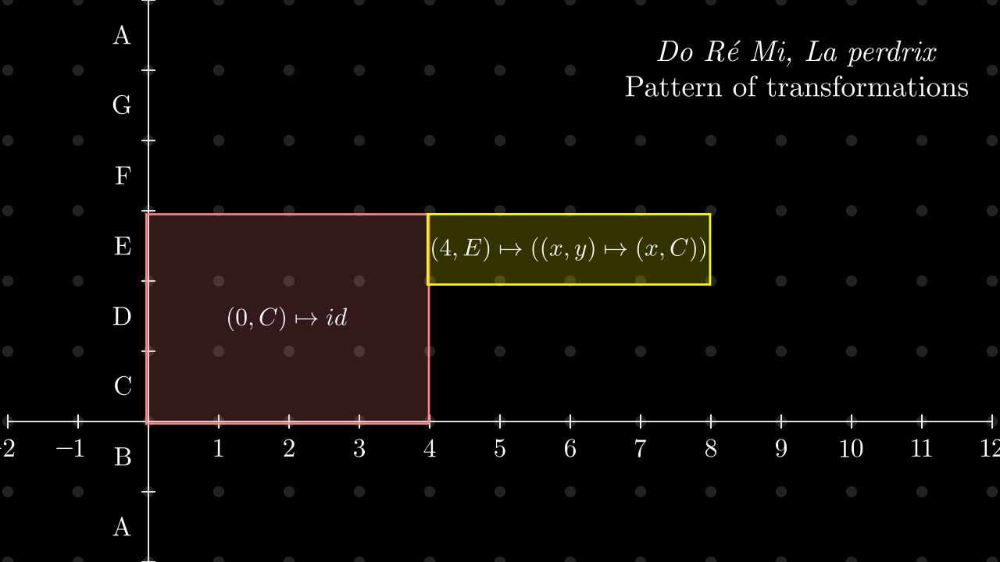
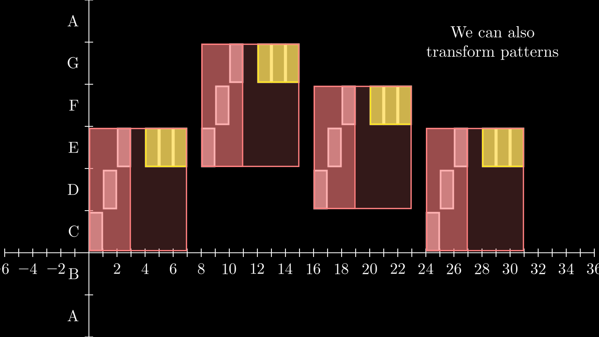
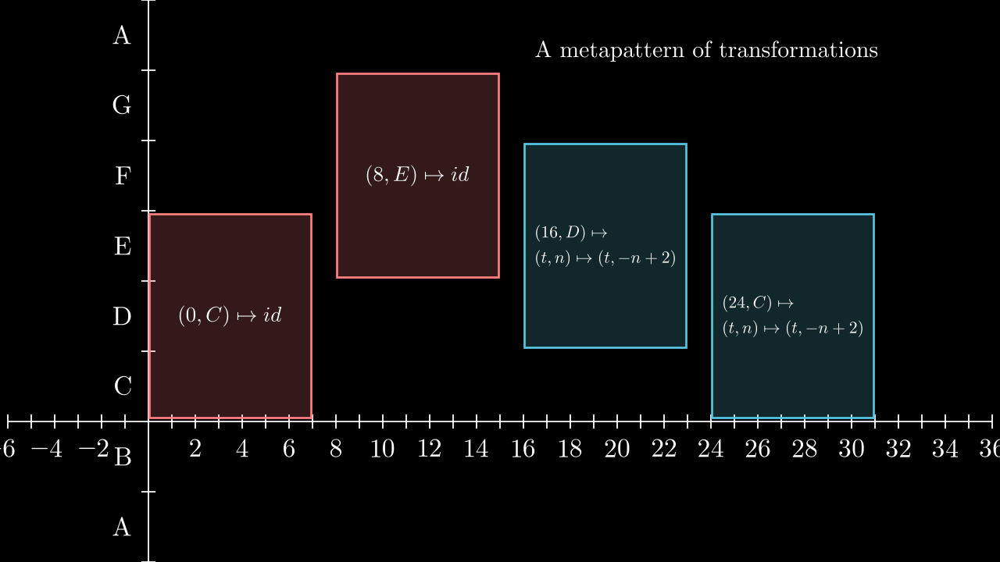
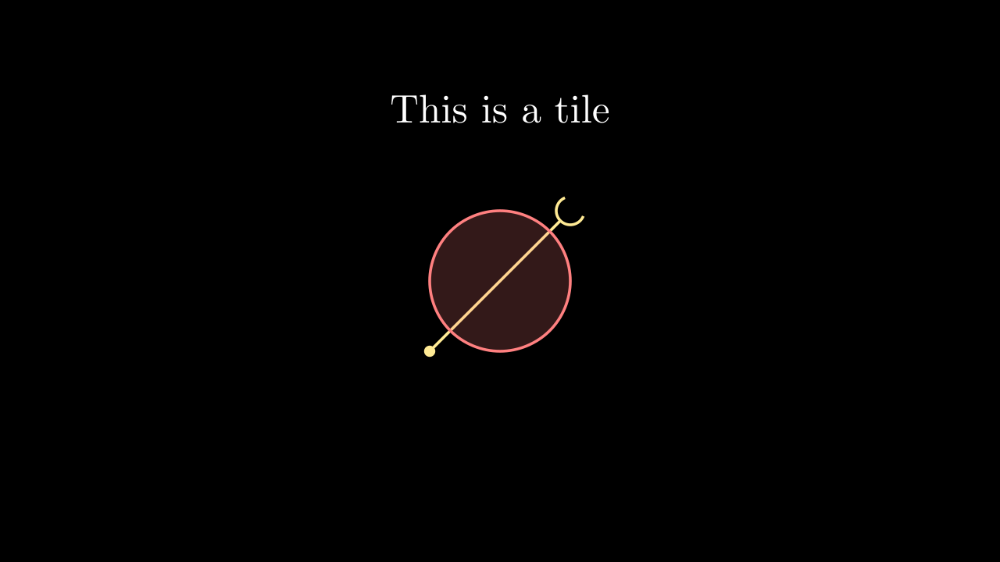
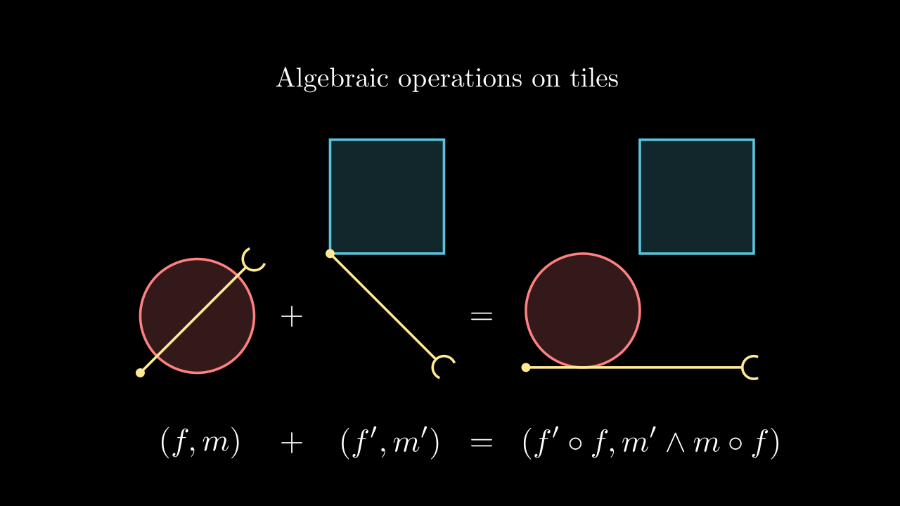
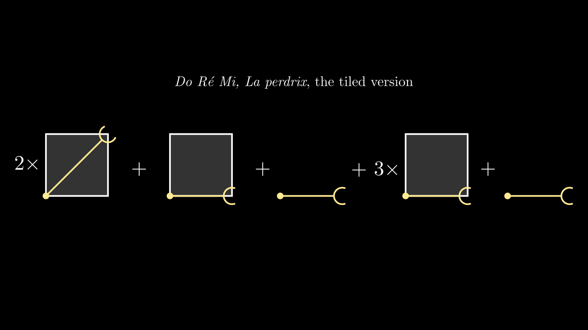
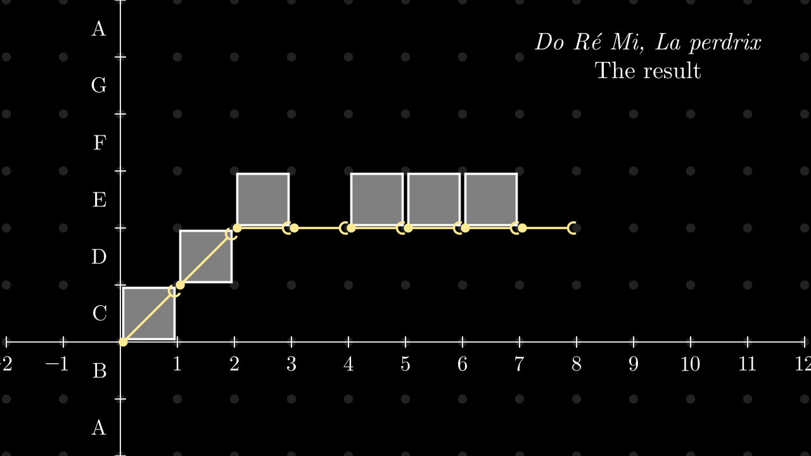

<!-- _class: title -->

# Structural representation of media

## **An introduction to hierarchised tiles**

### Alice Rixte

#### Université de Bordeaux

##### 13th of November, 2023
##### Sound and Fury of Modeling, Arpino Winter School

---

# What is musical structure ?

William E. Thomson, Functional Ambiguity in Musical Structures, 1983

Musical structure [...] refers to the way
elements are organized into patterns of coherence, the perceptual act of small events joining to create large events.

Morris R. Cohen, A preface to logic, 1944

Anything acquires meaning if it is connected with, or indicates, or refers to, something beyond itself, so that its full nature points to and is revealed in that connection.

---

# Structure could then be

## 1. A hierarchy

Atoms are combined together to form patterns, themself combined into metapaterns more and more complex.

## 2. An articulation of this hierarchy

The different components should be compared and related one to the other

---

# Outline

## 1. The hierarchy of patterns

- Level 0 (atoms) : music note, letter, pixel ...
- Level 1 (patterns of atoms) : bar, word ...
- Level 2 (patterns of patterns of atoms) : phrase, sentence ...
- Level 3 (patterns of patterns of patterns of atoms) : section, paragraph ...
- ...

---
# Outline

## 2.Transformations of patterns
They allow to express similarity between patterns

- Shifting
- Symmetries
- Scaling
- ...

---
# Outline

## 3. How to construct patterns

- A musical composition procesxs
- Algebraic operations over patterns
- Programmation language

---

# 1. The hierarchy of patterns

---

<!-- _class: manim-->

<video autoplay src="./media/videos/presentation-structure-tuile/720p30/FourPixels.mp4" >

---

<!--
_backgroundColor: black
_class: dark
-->

# More formally
- A pattern is a partial function from a space $X$ to a set of atoms $A$
- The type/set or patterns is $P = X \rightharpoonup A$

---

<!-- _class: manim-->

---

<!-- _class: manim-->

<video autoplay onclick="this.play()" src="./media/videos/presentation-structure-tuile/720p30/DoReMiNiveau0.mp4" >

---

<!-- _class: manim-->

<video autoplay onclick="this.play()"  src="./media/videos/presentation-structure-tuile/720p30/DoReMiNiveau05.mp4" >

---

<!--
_backgroundColor: black
_class: dark
-->

# Metapatterns

What if ?

What if we replaced atoms by patterns?

- The set of meta patterns would then be
 $P_2 = X \rightharpoonup P = X \rightharpoonup (X \rightharpoonup A)$

---

<!-- _class: manim-->

<video autoplay onclick="this.play()"  src="./media/videos/presentation-structure-tuile/720p30/DoReMiNiveau1.mp4" >

---

<!-- _class: manim-->

<video autoplay onclick="this.play()"  src="./media/videos/presentation-structure-tuile/720p30/DoReMiNiveau2.mp4" >

---

<!-- _class: manim-->

<video autoplay onclick="this.play()"  src="./media/videos/presentation-structure-tuile/720p30/DoReMiNiveau3.mp4" >

---

<!--
_backgroundColor: black
_class: dark
-->

# Let's recap

- Patterns $p: X\rightharpoonup A$ are partial function from the space $X$ to atoms $A$
- Metapatterns $p: X\rightharpoonup P_n$ are partial functions from space $X$ to subpatterns $P_{n-1}$
- By itering this construction, we get a _pattern hierarchy_.

---

<!--
_backgroundColor: black
_class: dark
-->

# **2.Transformations of patterns**

---

<!-- _class: manim-->

<video autoplay onclick="this.play()"  src="./media/videos/presentation-structure-tuile/720p30/Translation.mp4" >

---

<!-- _class: manim-->

<video autoplay onclick="this.play()"  src="./media/videos/presentation-structure-tuile/720p30/Symmetry.mp4" >

---

<!-- _class: manim-->

<video autoplay onclick="this.play()"  src="./media/videos/presentation-structure-tuile/720p30/Contraction.mp4" >

---

<!--
_backgroundColor: black
_class: dark
-->

#  Patterns of transformations

- We'd like to express the fact that "La Perdrix" corresponds to a constant pitch version of "Do Ré Mi".
- Let's use patterns of transformations !
- A pattern of transformations maps points of space $X$ to a transformation $p: X \rightharpoonup (X\rightarrow X)$

---

<!-- _class: manim-->

---

<!-- _class: manim-->

---

<!-- _class: manim-->

<video autoplay onclick="this.play()"  src="./media/videos/presentation-structure-tuile/720p30/DoReMiProjection.mp4" >

---

<!-- _class: manim-->

---

<!-- _class: manim-->

---

<!-- _class: manim-->

<video autoplay onclick="this.play()"  src="./media/videos/presentation-structure-tuile/720p30/Inversion3.mp4">

---

<!--
_backgroundColor: black
_class: dark
-->

# Transformations : recap

- One can transform patterns by applying a transformation
- Patterns of transformations allow to locally  les transformations localement.

---

<!--
_backgroundColor: black
_class: dark
-->

# 3. Building patterns

---

<!-- _class: manim -->

<video autoplay onclick="this.play()"  src="./media/videos/presentation-structure-tuile/720p30/ShowSpace.mp4">

---

<!-- _class: manim -->

<video autoplay onclick="this.play()"  src="./media/videos/presentation-structure-tuile/720p30/FirstCircle.mp4">

---

<!-- _class: manim -->

<video autoplay onclick="this.play()"  src="./media/videos/presentation-structure-tuile/720p30/FirstTransform.mp4">

---

<!-- _class: manim -->

<video autoplay onclick="this.play()"  src="./media/videos/presentation-structure-tuile/720p30/WholeDrawing.mp4">

---

<!--
_backgroundColor: black
_class: dark
-->

# Tiles

- Combining patterns and transformation allow to get an iterative process to draw .
- Patterns are hierarchised content.
- Transformations express the articulation of that content.

Definition of tile

A tile $t = (f,m)$ is a pair composed of a transformation  $f : X \rightharpoonup X$ and a pattern $p : X\rightharpoonup P$.

---

<!-- _class: manim-->

---

<!-- _class: manim-->

---

<!-- _class: manim-->

---

<!-- _class: manim-->

---

<!-- _class: manim -->

<video autoplay onclick="this.play()"  src="./media/videos/presentation-structure-tuile/720p30/DoReMiTuile1.mp4">

---

<!--
_backgroundColor: black
_class: dark
-->

# What tile allow

- Locate patterns relatively one to another.
- Duplicate patterns in time and space
- Overlapping patterns (in particular, anacrusis)
- ...

---

<!--
_backgroundColor: black
_class: dark
-->

# Conclusion

Hierarchised tiles are a language that allow:

1. hierarchic structuration of media
1. express similarities within that hierarchy
1. a constructivist approach based on the sum of tiles.

---
<!--
_backgroundColor: black
_class: dark
-->
#  On going and future work

- Implementation
- Rendering engines for diffent kind of media
- Real-time control on the hierarchy
- Multimedia performances

---

<!-- _class: manim -->

<video autoplay loop onclick="this.play()"  src="./media/videos/presentation-structure-tuile/720p30/SpirographCranks.mp4">

---
<!--
_backgroundColor: black
_class: dark
-->
#  Do you have questions ?