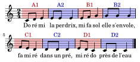
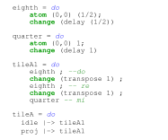

<!-- _class: title -->

# Modéliser la structure musicale avec les tuiles hiérarchiques

### Alice Rixte, David Janin

#### Université de Bordeaux, Bordeaux INP

##### 20 Juin 2024
##### Séminaire du SCRIME

---

# Précédemment ...

JIM 2023 : «LiveScaler : Contrôler en live l'harmonie d'un morceau de musique électronique»

- **Objectif** : changer l'harmonie à l'aide d'un contrôleur MIDI
- **Solution** : appliquer des transformations affines à des flux MIDI
- **Outils** : Ableton Live et Max MSP
- **Démo** : de la psytrance... C'était amusant !

---

# Transformations rythmiques

Et si on appliquait en live des transformations rythmiques ?

- Inversion du temps
- Passage du binaire au ternaire
- Quantisation
- ...

Pas si facile

- Distinguer en temps et hors-temps
- Délimiter la portée des transformations

---

# Live coding

- En live coding, **transformer des motifs**  est bien plus aisé et courant que sur les **stations audionumériques** (DAW).

Live coding

Performance musicale en live en utilisant un langage de programmation

- TidalCycles
- Chuck
- ixi lang

---

# Live coding pour la musique électronique de danse

Electronic Dance Music (EDM)

- Terme parapluie recouvrant plusieurs genres musicaux : techno, house, trance, dubstep, trap ...
- Principalement faite pour la danse (boîtes de nuit, festivals...)

EDM et live coding

- Scène algorave (Alex McLean, Nick Colins ...)
- Reste largement minoritaire par rapport au DJing

---

# Pratiques musicales en Electronic Dance Music

---

#  Architecture d'un langage de live coding

---

# Architecture d'un langage de live coding

---

# Quel modèle utiliser pour un tel langage?

Nous avons besoin d'une représentation symbolique :

- Structuré
- Flexible
- Expressif

C'est ce que tentent de faire les tuiles hiérarchiques.

---

# Les tuiles hiérarchiques, en une diapo

## 1. Motifs hiérarchiques

- Des **atomes** placés dans un **espace** peuvent être combinés pour former des **groupes**.
- Les groupes peuvent eux-même être regroupés : c'est une **structure de donnée arborescente**.
- C'est une version algébrique des **hiérarchies de transformations** utilisées en 3D

## 2.Tuilage

- Le tuilage permet de **changer de repère**
- Base sémantique pour un  **langage** de programmation **impératif**

---

# Et maintenant, les tuiles hiérarchiques ...   en 27 diapos

---

# 1. Motifs hiérarchiques

## a) Espaces et atomes
## b) Hiérarchie et transformations

---

# Espace et atomes

Une représentation multimedia

Un objet multimedia peut être représenté comme une liste de valeurs  positionnées dans un certain espace

---

<!-- _class: manim-->

---
# Do ré mi, la perdrix

---

<!-- _class: manim-->

---

# Un peu de syntaxe

---

# Hiérarchies de transformations

---

<!-- _class: manim-->

<video autoplay onclick="this.play()"  src="./media/videos/2024-05-06 JIM/720p30/Delay.mp4" >

---

<!-- _class: manim-->

<video autoplay onclick="this.play()"  src="./media/videos/2024-05-06 JIM/720p30/Transposition.mp4" >

---
<!-- _class: manim-->

<video autoplay onclick="this.play()"  src="./media/videos/2024-05-06 JIM/720p30/Projection.mp4" >

---

# Représentation arborescente

En posant

Le motif «Do ré mi, la perdrix» être représenté par

---

# Syntaxe

Pour coder un tel arbre, on utilise la syntaxe suivante :

---
# 2. Tuilage

## a) Intuition
## b) Syntaxe
## c) Sémantique

---

<!-- _class: manim -->

<video autoplay onclick="this.play()"  src="./media/videos/2024-05-06 JIM/720p30/ShowSpace.mp4">

---

<!-- _class: manim -->

<video autoplay onclick="this.play()"  src="./media/videos/2024-05-06 JIM/720p30/FirstCircle.mp4">

---

<!-- _class: manim -->

<video autoplay onclick="this.play()"  src="./media/videos/2024-05-06 JIM/720p30/WholeDrawing.mp4">

---

# Tuiles

- Combiner motif et changement de repère permet le positionnement relatif

Définition formelle

Une tuile  $t = (m,c)$ est une paire composée d'un motif $m$ et d'un changement de repère $c$.

---

<!-- _class: manim-->

---

<!-- _class: manim-->

---

<!-- _class: manim-->

---

<!-- _class: manim-->

---

# Tuiles hiérarchiques

Le même principe de tuilage s'applique lorsque le motif est hiérarchique.

---

<!-- _class: manim -->

<video autoplay onclick="this.play()"  src="./media/videos/2024-05-06 JIM/720p30/DoReMiTuile1.mp4">

---

# Syntaxe

---

<!-- _class: manim-->

<video autoplay onclick="this.play()"  src="./media/videos/2024-05-06 JIM/720p30/Inversion3.mp4">

---

# *Do ré mi, la perdrix* en entier

---

# Conclusion

Les tuiles hiérarchiques sont bien

- **Flexibles** : on peut encoder n'importe quel media avec
- **Structurées** : de part leur aspect hiérarchique
- **Expressives** :
  - on peut implémenter les transformations dont on a besoin
  - les tuiles pourront permettre d'ajouter du sucre syntaxique, des boucles, des conditions, etc.

---

# L'année prochaine ...

## Un langage de live coding et une démo !

---

#  Merci pour votre attention !